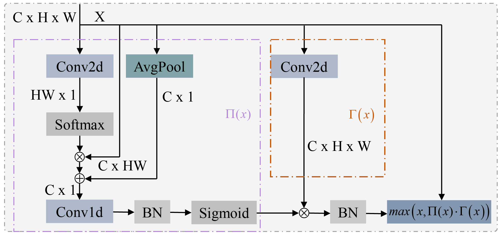

# SCeLU
## Learning Local Spatial and Global Context Activation for Visual Recognition

Abstract
----------
The selection of activation functions in visual recognition significantly influences training dynamics and task performance. This study introduces an activation function called local spatial and global context activation (SCeLU), which is a conceptually effective activation function. SCeLU extends the Rectified Linear Unit (ReLU) and FReLU to a 3D activation by incorporating a negligible overhead of spatial context conditions. The forms of ReLU and FReLU are $f\left( x \right) = max\left( {x,0} \right)$ and $f\left( x \right) = max\left( {x,{\rm T}\left( x \right)} \right)$, respectively, where ${\rm T}\left(  \cdot  \right)$ represents the 2D spatial condition. However, SCeLU takes the form of $f\left( x \right) = max\left( {x,\Pi (x) \cdot \Gamma \left( x \right)} \right)$, where $\Pi \left(  \cdot  \right)$ represents the 3D global context condition and $\Gamma \left(  \cdot  \right)$ represents the 2D local spatial condition. Intuitively, the context condition facilitates the modeling of global information, while the spatial condition enhances the capacity for local pixel-wise modeling. By appropriately combining spatial and context conditions, SCeLU demonstrates adaptability to complex visual layouts in various image recognition tasks. By simply changing the activation function, experiments conducted on ImageNet demonstrate a significant enhancement and robustness of SCeLU, particularly for small models, and some enhancements under partially highly optimized large models. Furthermore, our novel SCeLU seamlessly extends to object detection and semantic segmentation tasks, underscoring its effectiveness as an effective alternative in various visual recognition tasks.

--------------------------------------------------
A novel activation for visual recognition called SCeLU extends ReLU/FReLU to 3D by adding local spatial conditions $\Gamma \left( x \right)$ and global context conditions $\Pi (x)$.

## Contact Information

If you have any suggestion or question, you can contact us by: liuyunfei_215@163.com. Thanks for your attention!